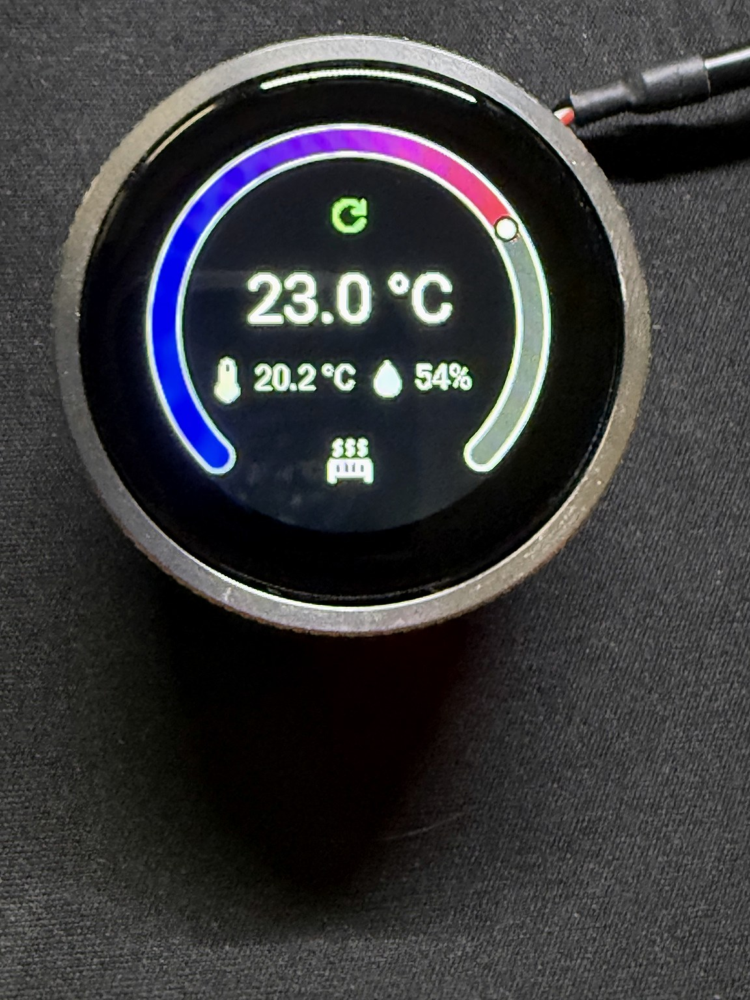
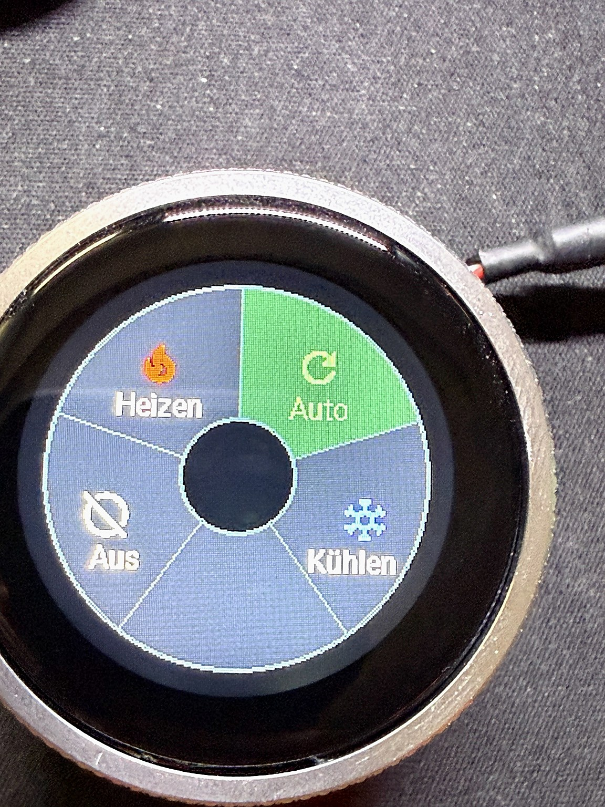
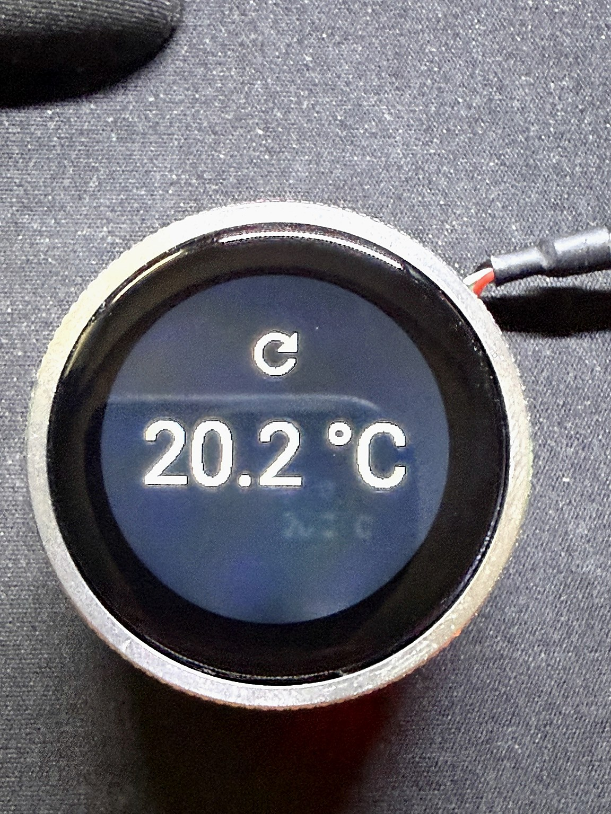

ESPHome Round Thermostat
A custom ESPHome thermostat interface for the Elecrow ESP32-S3 1.28"
Round HMI Display.
The project turns the round ESP32-S3 display into a Home
Assistant-compatible climate controller with rotary encoder input, touch
controls, operating-mode selection, standby display, status indicators
and notifications.

  

Features
- 240 × 240 round GC9A01A display
- CST816D capacitive touchscreen
- Rotary encoder for changing the target temperature
- Home Assistant climate entity
- Heating, cooling, auto and off modes
- Radial touch menu
- Configurable temperature step: 0.5 °C / 1.0 °C
- Current room temperature display
- Optional humidity display
- Configurable heating-source indicator
- Window-open indicator
- Notification indicator and notification popup
- Notification acknowledgement entity for Home Assistant automations
- Configurable standby timeout and standby brightness
- RGB LED ring with static and pulsing modes
- Restores climate mode, target temperature and display settings after
  reboot
- Optimized custom-rendered 270° temperature arc using PSRAM lookup
  tables
Hardware
Designed for the Elecrow ESP32 1.28" HMI IPS Knob with Touch, based
on an ESP32-S3.
Pinout
  Function                    GPIO
  Display SCLK              GPIO10
  Display MOSI              GPIO11
  Display DC                 GPIO3
  Display CS                 GPIO9
  Display RESET             GPIO14
  Display backlight         GPIO46
  Touch SDA                  GPIO6
  Touch SCL                  GPIO7
  Touch INT                  GPIO5
  Touch RESET               GPIO13
  Rotary encoder A          GPIO45
  Rotary encoder B          GPIO42
  Rotary encoder switch     GPIO41
  WS2812 RGB LEDs           GPIO48
  Power indicator           GPIO40
  Board OUT1                 GPIO1
  Board OUT2                 GPIO2
  Auxiliary I²C SDA         GPIO38
  Auxiliary I²C SCL         GPIO39
The auxiliary I²C bus is available for future sensors such as a BME280.
Software
The configuration was developed and tested with:
- ESPHome 2026.9.0
- ESP-IDF framework
- Home Assistant
- ESP32-S3 with octal PSRAM
The display currently uses ESPHome's ili9xxx component with the
GC9A01A model.
ESPHome currently reports ili9xxx as deprecated. The configuration
intentionally keeps the known-working implementation rather than
changing the display driver unnecessarily.

Installation:
Copy esphome-round-thermostat.yaml
into your ESPHome configuration directory.

Create a secrets.yaml containing your own credentials:

<code>
wifi_ssid: "YOUR_WIFI_SSID"
wifi_password: "YOUR_WIFI_PASSWORD"
fallback_hotspot_password: "YOUR_FALLBACK_AP_PASSWORD"
encryption_key: "YOUR_ESPHOME_API_KEY"
</code>

Do not commit secrets.yaml to Git.

Compile and flash the configuration through ESPHome as usual.

Home Assistant entities:

The device exposes the main thermostat as a climate entity:

Temperaturregler Wohnzimmer
The YAML can of course be renamed for another room before installation.
Additional entities include:

  Entity                             Purpose
  
  Isttemperatur                      Current room temperature supplied
                                     by Home Assistant
  Luftfeuchtigkeit                   Current humidity supplied by Home
                                     Assistant
  Temperatur Schrittweite            Selects 0.5 °C or 1.0 °C encoder
                                     increments
  Luftfeuchtigkeit Anzeige           Enables/disables humidity on the
                                     display
  Heizquelle                         Selects heat pump, radiator or air
                                     conditioner icon
  Fenster offen                      Window-open status
  Benachrichtigung                   Notification text
  Benachrichtigung vorhanden         Enables the notification indicator
  Benachrichtigung bestätigt         Briefly switches ON when a
                                     notification is acknowledged
  Timeout                            Standby timeout
  Standby Helligkeit                 Standby backlight level
  Display Hintergrundbeleuchtung     Display backlight control
  RGB Ring                           RGB LED ring
  RGB Ring Modus                     Static or pulsing RGB ring

The temperature and humidity entities are intentionally generic template
entities. Home Assistant automations can copy values from the actual
room sensors into them.

Controls:

Rotary encoder
Turn the encoder to change the target temperature.
The increment can be configured as either:
- 0.5 °C
- 1.0 °C
The target temperature is limited to 5--30 °C.
Encoder input is ignored while the display is in standby or while a
notification popup is open.

Touchscreen
Touch the normal thermostat screen to open the radial operating-mode
menu.

  

The menu provides:
- Auto
- Heat
- Cool
- Off
- Notification
The notification segment is only active when a notification is present.
Standby
After the configured inactivity timeout, the thermostat enters standby
mode.

  

The standby screen displays:
- Current operating-mode icon
- Current room temperature
- Off instead of the temperature when the climate entity is switched
  off
- Notification indicator when a notification is pending
A single touch wakes the display without triggering another action.
Setting the timeout to 0 disables automatic standby.
Notifications
Home Assistant can write text to the Benachrichtigung entity and
enable Benachrichtigung vorhanden.
A notification icon then appears on the thermostat.
Opening the radial menu and selecting the notification segment displays
the message. Touching the notification popup acknowledges it.
The Benachrichtigung bestätigt binary sensor switches ON for
approximately 500 ms and then returns to OFF. This can be used as a
trigger in Home Assistant.
The thermostat deliberately does not clear the notification text or
notification-present state itself. That logic can be handled by a Home
Assistant automation.

Display design:

The normal screen uses a 270° temperature arc.
- Minimum temperature: 5 °C
- Maximum temperature: 30 °C
- Blue indicates the lower end of the range
- Red indicates the upper end
- The current target is marked by a circular marker
- The unused portion of the arc remains dark
The target temperature is shown in the center. When climate mode is OFF,
the target is replaced by Off.
Current room temperature and optional humidity are displayed below the
target temperature.
Status icons at the bottom indicate the selected heating source, an open
window and pending notifications.

Rendering performance:

The temperature ring is custom-rendered rather than assembled from
standard UI widgets.
To reduce the amount of geometry calculated during normal display
updates, the configuration precomputes supersampled ring geometry into
lookup tables stored in ESP32-S3 PSRAM.

The display uses:
update_interval: never
auto_clear_enabled: false
and is explicitly redrawn when relevant values change.
This substantially reduces unnecessary rendering work while retaining
antialiased ring geometry.

RGB ring:

The board's five WS2812 LEDs are exposed to Home Assistant.
Two operating modes are currently provided:
- Dauerlicht --- static light
- Pulsierend --- pulsing effect
The mode selector intentionally uses:
restore_value: false
Do not casually change this to true. Restoring the pulsing effect
during early ESPHome startup caused boot crashes during development.
Notes
GPIO3 and GPIO46 may generate ESPHome strapping-pin warnings. These pins
are part of the board's existing hardware design and are intentionally
used.

The CST816D configuration uses its interrupt pin and skip_probe: true.
The project is designed around this specific Elecrow board. Other round
ESP32-S3 boards may require changes to the display, touch, encoder,
PSRAM and GPIO configuration.

Possible future additions:

The available auxiliary I²C connection makes additional environmental
sensors possible, for example:
- BME280 temperature/humidity/pressure sensor
- Other external room-temperature sensors

The thermostat is primarily intended as a Home Assistant user interface,
so the actual heating control logic can remain centralized in Home
Assistant.

AI-assisted development:

The complete ESPHome YAML configuration for this project was developed
with the assistance of OpenAI ChatGPT through an iterative process
of implementation, testing, debugging and refinement.
The published YAML is fully AI-generated based on the project
requirements and hardware information provided during development. It
was then tested on the actual hardware and iteratively corrected and
refined according to the test results.

License:

This project is released under the CC BY-NC 4.0 – Attribution-NonCommercial 4.0 International

Attribution:

When redistributing this project or substantial portions of it, retain
the project name, copyright notice and license information.

Development disclosure: the ESPHome YAML was created with the assistance
of OpenAI ChatGPT and iteratively tested and refined on real hardware.
